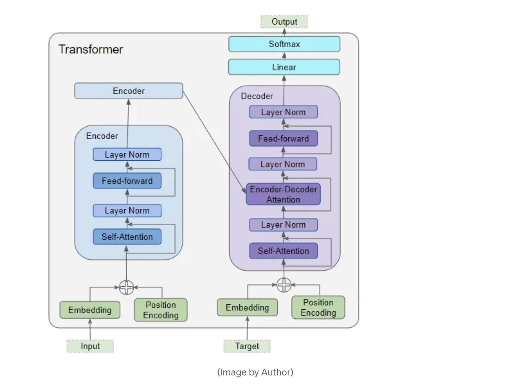
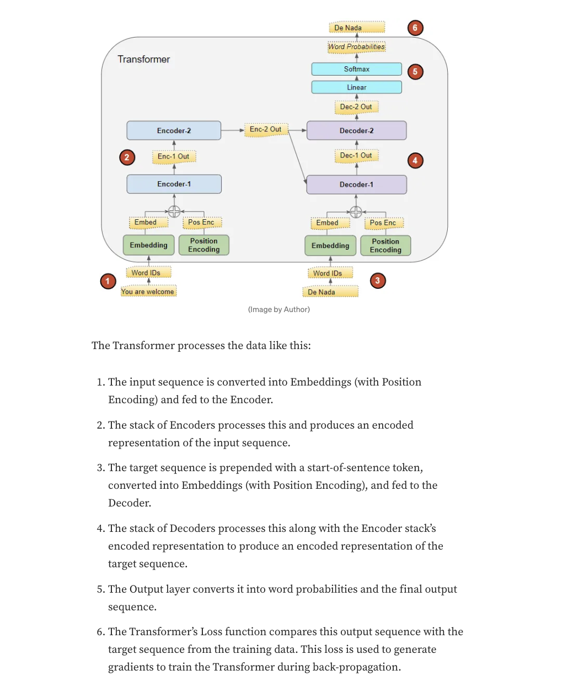
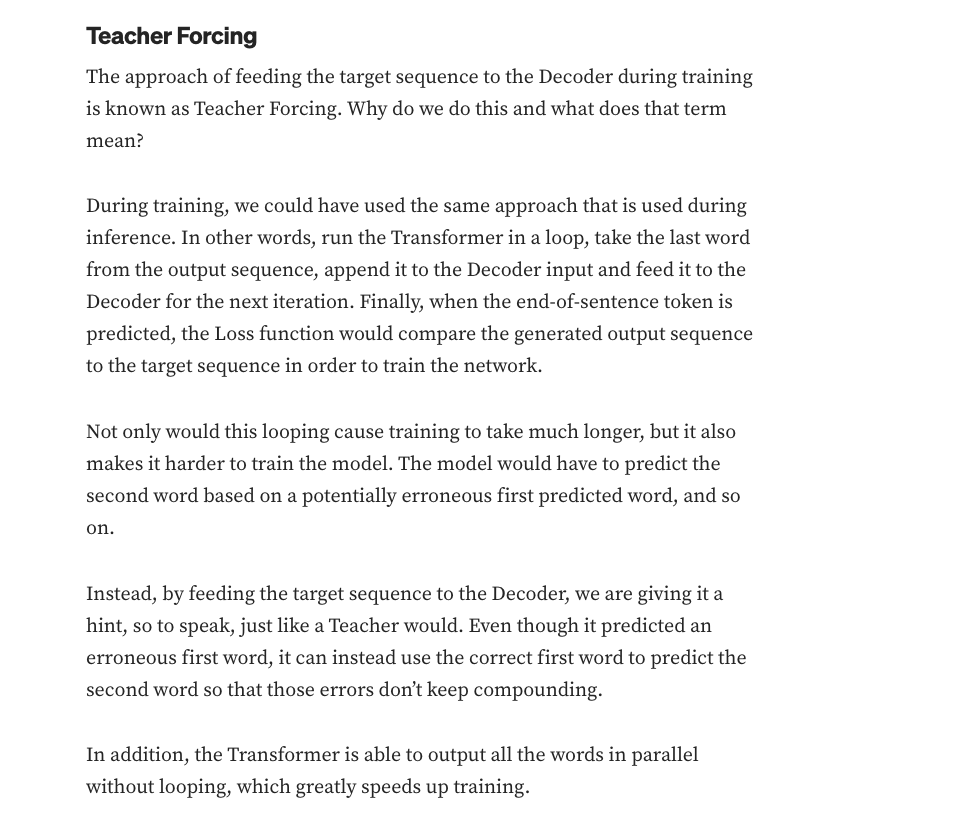
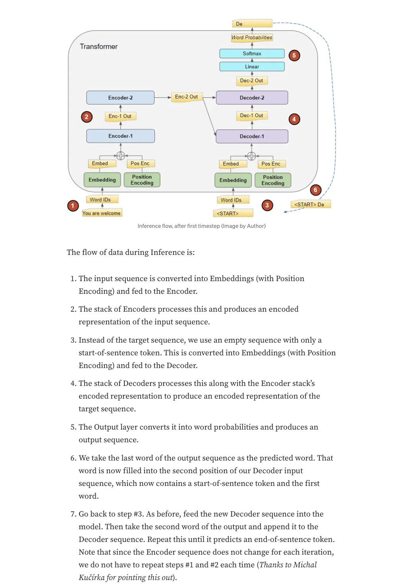
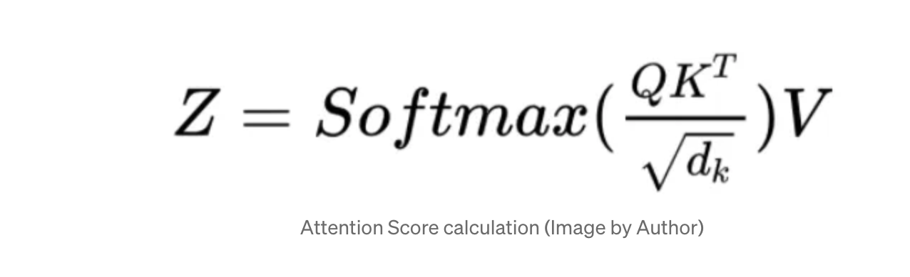
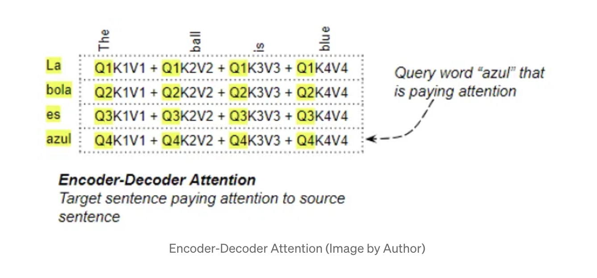
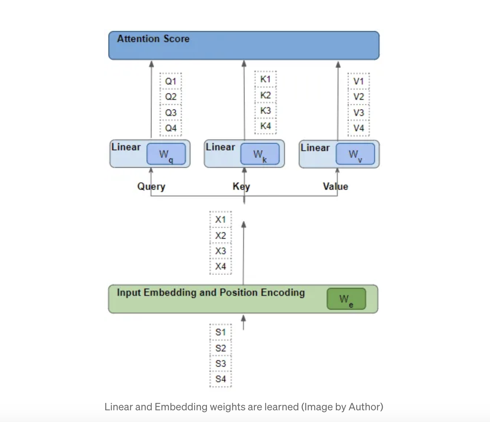
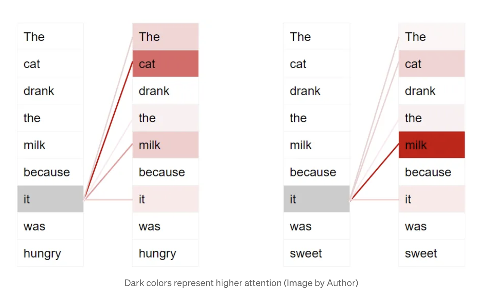
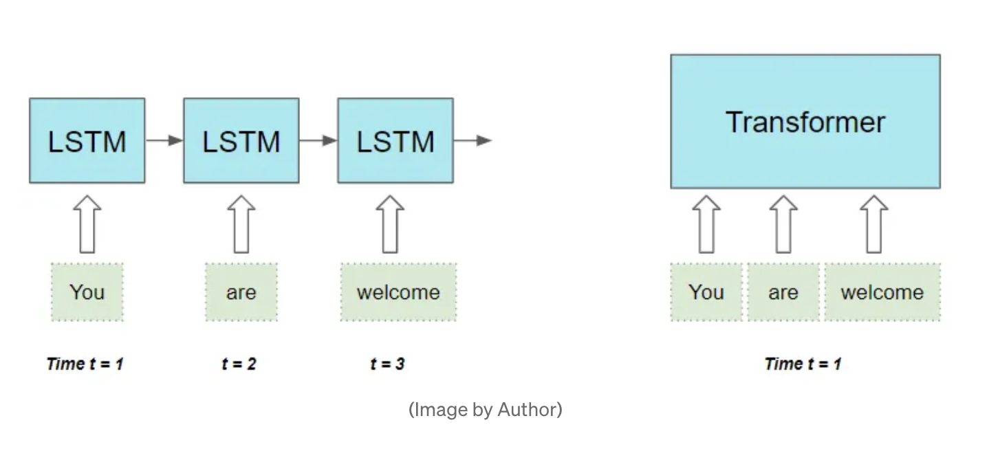

# shakespeareGPT

shakespeareGPT is a transformer language model that generates more Shakespearian-like text.

This project is for educational purposes and follows the course [Neural Networks: Zero to Hero by Andrej Karpathy](https://www.youtube.com/watch?v=PaCmpygFfXo&list=PLAqhIrjkxbuWI23v9cThsA9GvCAUhRvKZ&index=2).

***Source code is commented to demonstrate independent understanding of core concepts as well as for ease of future read-throughs. Additional coding files used during independent learning process are also included. Annotated research papers that implemented models are based on are also included.***
___

## Key Papers That Current Implementation Follow
- [Attention Is All You Need](https://github.com/AngelaYu-3/shakespeareGPT/blob/main/annotated_papers/attentionIsAllYouNeed.pdf)
___

## Resources
Transformers Explained Article Series by Ketan Doshi that helped me better understand the inner-workings of transformers
- [Overview of Functionality](https://towardsdatascience.com/transformers-explained-visually-part-1-overview-of-functionality-95a6dd460452)
- [How It Works, Step-By-Step](https://towardsdatascience.com/transformers-explained-visually-part-2-how-it-works-step-by-step-b49fa4a64f34)
- [Multi-Head Attention, Deep Dive](https://towardsdatascience.com/transformers-explained-visually-part-3-multi-head-attention-deep-dive-1c1ff1024853)
- [Not Just How, But Why They Work](https://towardsdatascience.com/transformers-explained-visually-not-just-how-but-why-they-work-so-well-d840bd61a9d3)

___

## Notes

***all diagrams are from articles by Ketan Doshi which are linked above***

___
**Training**

___
**Inference**

___

**Input Vectors**

- query, key, & value vectors are created from generated word vectors put through linear layer
- query: word for which we are calculating attention, used to compare against key to determine attention score
- key: word to which we are paying attention, reference vector to which query will be compared, each key represents a specific "feature" of the token that might be relevant for attention
- value: actual information that transformer uses to process the output, after attention scores are calculated by taking dot product of query & key values are weighted by those scores and aggregated to output the final attention score

- query, key, and value are vectors with an embedding dimension--if two words are more relevant to each other, those vectors are more aligned

- word vectors are generated based on word embedding and weights of linear layers--what is learned by the transformer model

___

**Self-Attention**

- want attention score to be high between two words that are more relevant to each other

- self-attention in encoder: source sequence pays attention to itself
- self-attention in decoder: target sequence pays attention to itself
- self-attention in encoder-decoder: target sequence pays attention to source sequences

___

**Efficiency**

- positional encoding & word encoding along with ability to process multiple words at once (not sequentially) makes transformers more efficient
  

___

**Masking**

- masking in training: autoregressive training by not letting tokens "view ahead" and cheat the training process, tokens should only be able to train based on past tokens ("creating more datasets"--if there are 9 words in a sentence, there are essentially 8 datasets to train on)
- masking in inference: keeps autoregressive network structure, prevents previous generated tokens from self-attentioning to future positions (future tokens not generated yet)
- during inference attention needs to be recalculated because model needs to update its understanding of the entire context not just of one token, dynamic nature of attention (attention weights between 1 and 2 token might change based on the generation of 3 token, previous token weights can change based on generated token now that there's new context)

___
## Included Dataset

The included example **shakespeareData.txt** dataset has Shakespeare passages [dataset](https://raw.githubusercontent.com/karpathy/char-rnn/master/data/tinyshakespeare/input.txt).

___

## License
MIT
